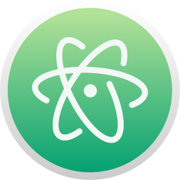

----



[Atom](https://atom.io) is assumed to be Tidal Cycles's default text editor for newcomers. It is an intuitive but featureful code editor that can be extended with numerous plugins. You will see quite a lot of users coding with Atom because it has been recommanded for quite a while and for good reasons. The [Tidal Cycles Package](https://atom.io/packages/tidalcycles) is one of the most complete you can currently find. Atom is a free, cross-platform and open-source software. Note that there is also a [SuperCollider package](https://atom.io/packages/supercollider) that you can use as an alternative to the official IDE. Atom also supports alternative modes of input (Vim-like) through the help of various packages.

## Installation 

The easiest way to find out how to install Atom is to head to the [official website](https://atom.io). Linux and MacOS users, you are likely to find it in your package manager. The installation process is hassle-free.

### Installing the Tidal Cycles plugin 

Open Atom. Click on `Preferences > Install`. Search for `tidalcycles`. Click on `install`. Wait a moment.. and that's all :smile:. Be sure to check the package options as well for more customization. 

### Revert to an earlier version of the plugin

Sometimes, you will need to install and old version of the Atom Package to match with a particular Tidal version. You can do this by using the command line. To install the hypothetic `0.9.x` version of the package, run the following line:

```bash
apm install tidalcycles@0.12.1
```

-----

## More about the Tidal Package

### Forum discussion 

The Tidal Package for Atom is developed by `ndr_brt`. You can find a [thread](https://club.tidalcycles.org/t/the-atom-plugin-thread/2244) on the Tidal Club forum to get more information directly from the community: features, requests, bug reports, etc...

### GitHub repository

There is a [GitHub repository](https://github.com/tidalcycles/atom-tidalcycles) if you want to contribute, report an issue or follow the development. 
